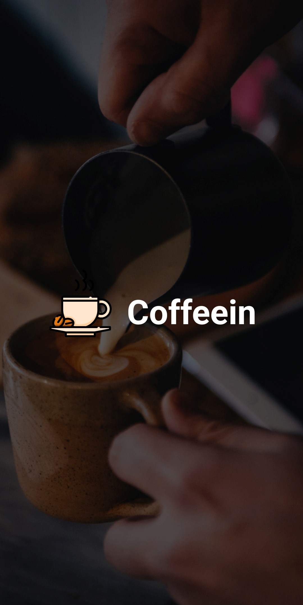
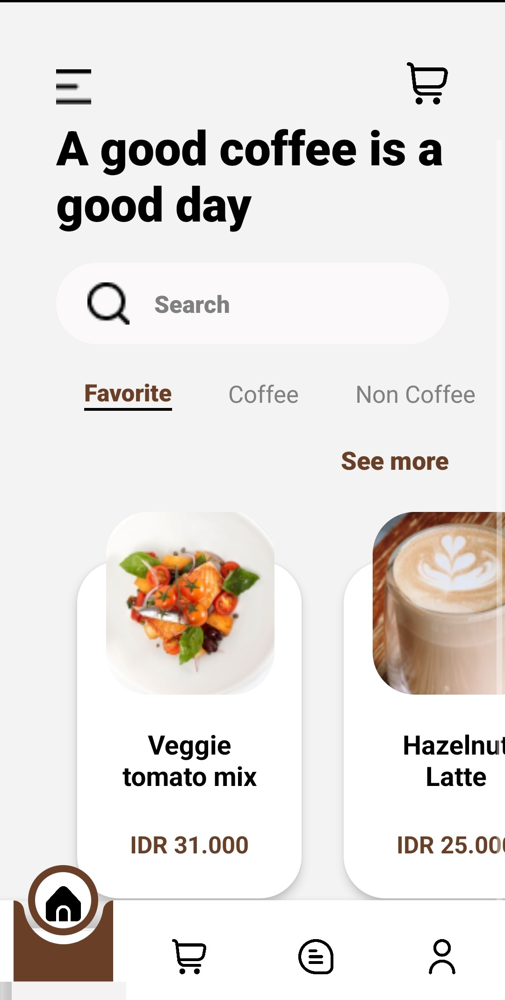
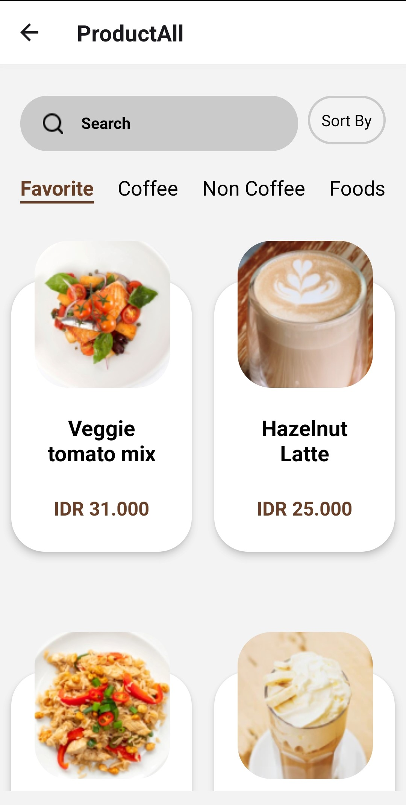
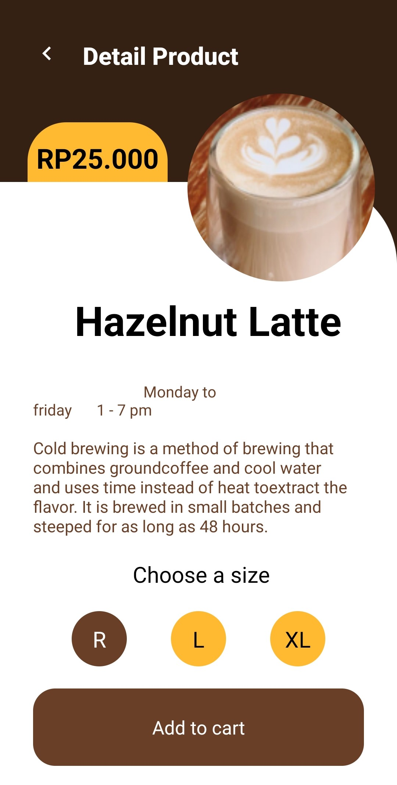
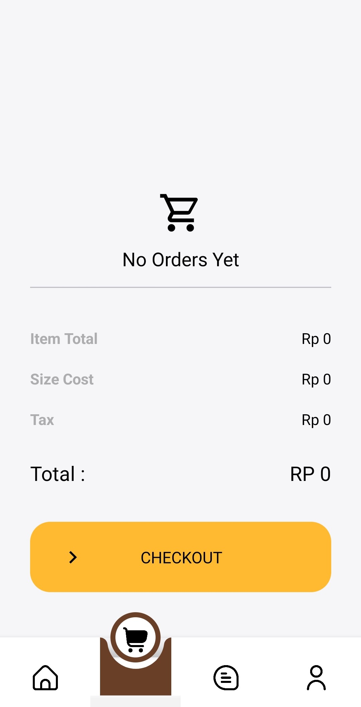
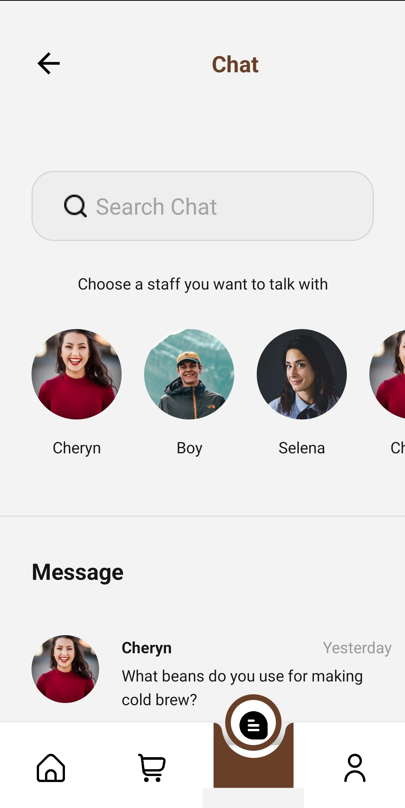
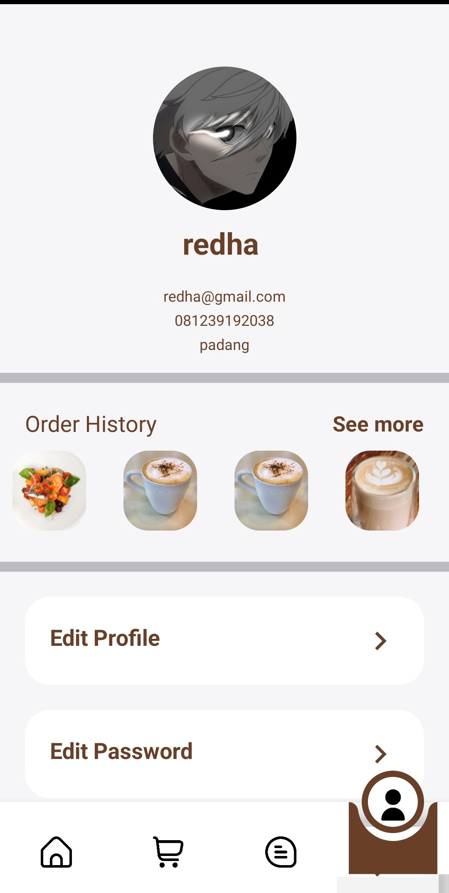

## Readme Top

<div align="center">

<h3 align="center">Coffe Shop</h3>

  <p align="center">
    <a href="https://drive.google.com/drive/folders/18ztfyUowhVoFHVjp7wfdCmno0X1-wDZa">View Demo</a>
    ·
    <a href="https://github.com/redhadefinto/coffeein-mobile/issues">Report Bug</a>
    ·
    <a href="https://github.com/redhadefinto/coffeein-mobile/pulls">Request Feature</a>
  </p>
</div>

<!-- TABLE OF CONTENTS -->
<details>
  <summary>Table of Contents</summary>
  <ol>
    <li>
      <a href="#about-the-project">About The Project</a>
      <ul>
        <li><a href="#built-with">Built With</a></li>
      </ul>
    </li>
    <li>
      <a href="#getting-started">Getting Started</a>
    </li>
    <li><a href="#Link-Download">Link Download</a></li>
    <li><a href="#usage">Usage</a></li>
    <li><a href="#contact">Contact</a></li>
    <li><a href="#acknowledgments">Acknowledgments</a></li>
    <li><a href="#Documentation">Documentation</a></li>
    <li><a href="#Contributor">Contributor</a></li>
  </ol>
</details>

<!-- ABOUT THE PROJECT -->

## About The Project

"Our coffee shop web application brings the delightful experience of a café to your screen. Discover an extensive menu of coffee and tea specialties, explore personalized recommendations, place orders with ease, and enjoy the convenience of online payment and delivery options. Immerse yourself in a virtual coffee shop ambiance, where you can connect with fellow coffee enthusiasts, learn about the origins of different brews, and stay updated on upcoming events and promotions. Whether you're seeking a quick pick-me-up or a relaxing coffee break, our web application ensures a seamless and enjoyable coffee shop experience from the comfort of your own device."

<p align="right">(<a href="#readme-top">back to top</a>)</p>

### Built With

<p align="center">
  <a href="https://skillicons.dev">
    
  </a>
</p>

<p align="right">(<a href="#readme-top">back to top</a>)</p>

<!-- GETTING STARTED -->

## Getting Started

### 1. Clone this repository

Clone this repository by run the following code:

```
$ git clone https://github.com/redhadefinto/coffeein-mobile

```

### 2. Install dependency packages

Install dependency packages by run the following code inside project folder:

```
$ npm install
```

### 3. Configure .env file

Configure .env file by create file named .env inside project folder and add this line to the file:

```
SERVER_HOST = [https://coffe-shop-gamma.vercel.app/](https://coffe-shop-gamma.vercel.app/)

```

### 4. Running app

1.  Start Metro

    ```
    npx react-native start
    ```

2.  Start app

    ```
    npx react-native run-android
    ```

<p align="right">(<a href="#readme-top">back to top</a>)</p>

<!-- USAGE EXAMPLES -->

## Documentation

<div>




</div>
<div>



</div>

<p align="right">(<a href="#readme-top">back to top</a>)</p>

<!-- CONTACT -->

## Contact

Redha Definto - redhadefinto28@gmail.com

Project Link: [https://github.com/redhadefinto/coffe_shop_fe](https://github.com/redhadefinto/coffe_shop_fe)

<p align="right">(<a href="#readme-top">back to top</a>)</p>

## Link Download

[Download APP](https://drive.google.com/drive/folders/18ztfyUowhVoFHVjp7wfdCmno0X1-wDZa)

<p align="right">(<a href="#readme-top">back to top</a>)</p>

<!-- Contributor -->

## Contributor

  <table>
    <tr>
      <td >
        <a href="https://github.com/redhadefinto">
          <br/>
          <center><sub><b>Redha Definto </b></sub></center>
        </a>
        </td>
    </tr>
  </table>
<h1 align="center"> THANK FOR YOUR ATTENTION </h1>

<!-- MARKDOWN LINKS & IMAGES -->
<!-- https://www.markdownguide.org/basic-syntax/#reference-style-links -->

<!-- [product-screenshot]: index.png -->

[Next.js]: https://img.shields.io/badge/next.js-000000?style=for-the-badge&logo=nextdotjs&logoColor=white
[Next-url]: https://nextjs.org/
[React.js]: https://img.shields.io/badge/React-20232A?style=for-the-badge&logo=react&logoColor=61DAFB
[React-url]: https://reactnative.dev/
[Redux]: https://img.shields.io/badge/redux-%23593d88.svg?style=for-the-badge&logo=redux&logoColor=white
[Redux-url]: https://redux.js.org/
